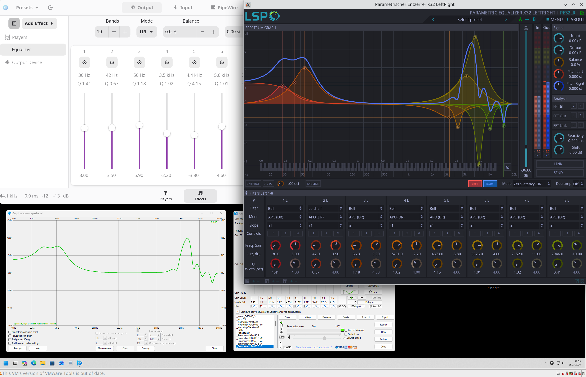

# Convert PEACE to Easy Effects

Converts [PEACE Equalizer](https://sourceforge.net/projects/peace-equalizer-apo-extension/) `.peace` profiles to [Easy Effects](https://github.com/wwmm/easyeffects) JSON presets.

Migrating from Windows to Linux and want to keep using your PEACE EQ settings? This script allows you to convert your existing PEACE profiles to Easy Effects presets without needing to manually recreate them. With just one command you can convert and deploy your custom EQ curves from PEACE Equalizer to Easy Effects. Thanks to LSP, you can even visually compare the frequency response curves in both applications to confirm that the conversion is correct. 



Supported profile content: **all standard EqualizerAPO filter types** (Bell/Peak, Low/High Shelf, Low/High Pass, Bandpass, Notch, Allpass) and input gain (PreAmp). Per-speaker band assignments are ignored; all bands are applied to both left and right channels, which is the correct behaviour for headphone EQ.

## Requirements

- Python 3.10+
- No third-party packages — standard library only

## Usage

```bash
python3 convert_peace.py FILE.peace [FILE.peace ...]
```

### Options

| Flag | Description |
|------|-------------|
| `-o DIR`, `--output-dir DIR` | Write `.json` files to `DIR` instead of the same directory as the input |
| `--skip-zero-gain` | Omit bands whose gain is exactly 0 dB (they have no audible effect) |
| `-v`, `--verbose` | Print per-file details during conversion |

### Examples

```bash
# Convert a single profile, output next to the source file
python3 convert_peace.py _HD660S.peace

# Convert all profiles and deploy directly to Easy Effects (native install)
python3 convert_peace.py *.peace --output-dir ~/.config/easyeffects/output

# Flatpak install
python3 convert_peace.py *.peace \
    --output-dir ~/.var/app/com.github.wwmm.easyeffects/config/easyeffects/output

# Skip flat bands and show details
python3 convert_peace.py *.peace --skip-zero-gain --verbose
```

After conversion, Easy Effects will list the new presets in its preset browser immediately — no restart needed.

## Output format

Each `.peace` file produces one `.json` file with the same stem. The preset uses:

- Plugin: `equalizer#0`
- Band mode: `APO (DR)` — matches the EqualizerAPO Digital Recursive biquad algorithm
- Equalizer mode: `IIR` — correct for APO (DR) per-band filters
- Filter types decoded from the `[Filters]` section: `Bell`, `Lo-shelf`, `Hi-shelf`, `Lo-pass`, `Hi-pass`, `Bandpass`, `Notch`, `Allpass`

### PEACE `[Filters]` code mapping

Filter codes are taken from the `$FilterTypes` array in `Peace.au3`.

| Code | PEACE name | APO filter string written | Easy Effects type | Notes |
|------|-----------|--------------------------|------------------|-------|
| 0 (default) | PK | `ON PK Fc Hz Gain dB Q` | Bell | |
| 1 | LPQ | `ON LPQ Fc Hz Q` | Lo-pass | |
| 2 | HPQ | `ON HPQ Fc Hz Q` | Hi-pass | |
| 3 | BP | `ON BP Fc Hz Q` | Bandpass | |
| 4 | LS | `ON LS Fc Hz Gain dB` | Lo-shelf | No Q; APO defaults to S=0.9; EE Q set to 2/3 |
| 5 | HS | `ON HS Fc Hz Gain dB` | Hi-shelf | No Q; APO defaults to S=0.9; EE Q set to 2/3 |
| 6 | NO | `ON NO Fc Hz Q` | Notch | |
| 7 | AP | `ON AP Fc Hz Q` | Allpass | |
| 8 | LSC | `ON LSC S dB Fc Hz Gain dB` | Lo-shelf | `[Qualities]` = slope (dB/oct); EE Q = sqrt(slope/24) |
| 9 | HSC | `ON HSC S dB Fc Hz Gain dB` | Hi-shelf | `[Qualities]` = slope (dB/oct); EE Q = sqrt(slope/24) |
| 10 | BWLP | multiple `ON LPQ` lines | Lo-pass | Butterworth LP — cascaded biquads, single-band approx |
| 11 | BWHP | multiple `ON HPQ` lines | Hi-pass | Butterworth HP — cascaded biquads, single-band approx |
| 12 | LRLP | multiple `ON LPQ` lines | Lo-pass | Linkwitz-Riley LP — cascaded biquads, single-band approx |
| 13 | LRHP | multiple `ON HPQ` lines | Hi-pass | Linkwitz-Riley HP — cascaded biquads, single-band approx |
| 14 | LSCQ | `ON LSC Fc Hz Gain dB Q` | Lo-shelf | `[Qualities]` = biquad Q, centre freq |
| 15 | HSCQ | `ON HSC Fc Hz Gain dB Q` | Hi-shelf | `[Qualities]` = biquad Q, centre freq |
| 16 | LSQ | `ON LS Fc Hz Gain dB Q` | Lo-shelf | `[Qualities]` = biquad Q, **corner** freq (APO adjusts to centre internally) |
| 17 | HSQ | `ON HS Fc Hz Gain dB Q` | Hi-shelf | `[Qualities]` = biquad Q, **corner** freq (APO adjusts to centre internally) |

## Testing

The `test/` directory contains one `.peace` file for each PEACE filter code (codes 0–17) with known, simple settings. Run the converter against them and compare the output JSON visually or by loading the presets in Easy Effects:

```bash
python3 convert_peace.py test/*.peace --output-dir test/ --verbose
```

To do a quick side-by-side check of a converted preset:

1. Open PEACE on Windows and load the `.peace` file — note the displayed frequency response curve.
2. Copy the generated `.json` file into `~/.config/easyeffects/output/` (or the Flatpak equivalent).
3. Load the preset in Easy Effects and compare the frequency response curve using LSP (Show Native Window button).

For most filter types (Bell, Lo/Hi-pass with Q, Bandpass, Notch, Allpass, Lo/Hi-shelf with Q) the curves should be identical. Filter types that PEACE expands into cascaded biquad stages (Butterworth LP/HP, Linkwitz-Riley LP/HP — codes 10–13) are approximated as a single band, so a small difference in the roll-off region is expected.

## Reporting a wrong conversion

If you find a profile that is not converted correctly, please [open an issue](https://github.com/m1lhaus/convert-peace-to-easyeffects/issues) and include the `.peace` file that produces the wrong result (attach it to the issue).